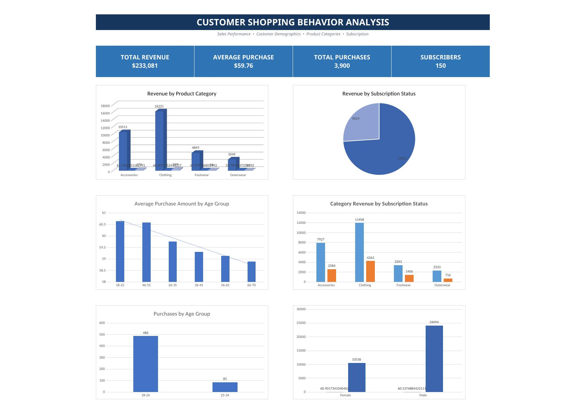

# 🍕 Customer_Shopping_Behavior_Analysis

From raw customer data to PivotTables, business insights, and an interactive dashboard.



---

## 📌 Introduction: Why I Built This Project

I decided to start building practical Data Analytics projects instead of only learning Excel formulas and watching tutorials.
For my first project, I worked with a customer shopping behavior dataset and used Microsoft Excel to take the analysis from raw records to business-ready insights.
The project gave me hands-on experience with a complete beginner-friendly analytics workflow:

- Understanding the dataset
- Checking data quality
- Creating analytical fields
- Building PivotTables
- Answering business questions
- Designing charts
- Bringing the results together in a dashboard

---

# Step 1: Understanding the Dataset

The dataset contains **3,900 customer shopping records** and **18 original variables**. The fields cover customer demographics, products, purchases, location, seasonality, ratings, subscriptions, shipping, promotions, payment methods, and purchasing frequency.

### Key Fields Include:

- Customer ID
- Age
- Gender
- Item Purchased
- Category
- Purchase Amount (USD)
- Location
- Size
- Color
- Season
- Review Rating
- Subscription Status
- Shipping Type
- Discount Applied
- Promo Code Used
- Previous Purchases
- Payment Method
- Frequency of Purchases

Before analyzing the data, I wanted to make sure I understood what each column represented and what kinds of business questions the dataset could answer.

---

# Step 2: Preparing the Data

I checked the dataset for missing values and duplicate customer IDs.
I also created three analytical columns to make the analysis easier to interpret:

### Age Group

Grouped customers into:

- 18–25
- 26–35
- 36–45
- 46–55
- 56–65
- 66–70

### Purchase Value Group

Classified purchases as:

- Low
- Medium
- High
- Very High

### Customer Type

Classified customers as:

- New
- Occasional
- Regular
- Loyal

These groups were based on previous purchases.

This step showed me that Data Analytics is not only about creating charts. The quality and structure of the data directly affect how clearly the results can be understood.

---

# Step 3: Exploring the Data with PivotTables

## PivotTable 1 — Revenue by Product Category

### Business Question

**Which product category generates the highest total purchase amount?**

### Result

Clothing generated the highest total purchase amount at **$104,264**, representing approximately **44.7%** of the **$233,081** total.

Accessories followed with **$74,200**.

Together, Clothing and Accessories accounted for approximately **76.5%** of the total purchase amount.

---

## PivotTable 2 — Average Purchase by Age Group

### Business Question

**Which age group has the highest average purchase amount?**

### Result

The **18–25 age group** had the highest average purchase amount at **$60.65**, followed closely by the **46–55 age group** at **$60.58**.

The difference across age groups was relatively small, suggesting that the average transaction value was fairly consistent across the age bands in this analysis.

---

## PivotTable 3 — Gender Analysis

### Business Question

**Do male and female customers have different purchasing behavior?**

### Result

In the displayed PivotTable:

| Gender | Average Purchase Amount | Total Purchase Amount |
| ------ | ----------------------: | --------------------: |
| Female |                  $60.90 |               $10,536 |
| Male   |                  $60.54 |               $24,094 |

The total purchase amount was **$34,630** for the records represented by this PivotTable.

Female customers had a slightly higher average purchase amount, while male customers generated a higher total purchase amount because the displayed records included more male purchases.

---

## PivotTable 4 — Subscription Analysis

### Business Question

**Do subscribed customers spend more than non-subscribed customers?**

### Result

For the **571 records** represented in the subscription analysis:

| Customer Type   | Total Purchase Amount | Average Purchase |
| --------------- | --------------------: | ---------------: |
| Non-Subscribers |               $25,611 |           $60.83 |
| Subscribers     |                $9,019 |           $60.13 |

The average purchase difference is small, so the data does not show higher average transaction value among subscribers.

---

## PivotTable 5 — Subscription Status by Gender

### Business Question

**Is subscription behavior different between male and female customers?**

### Result

Among the **571 records** represented in this PivotTable:

* There were **173 female records** with no subscribed records.
* There were **398 male records**.
* **150 male records** were subscribed.

Therefore, all **150 subscribed records** in this analyzed subset were male.

---

## PivotTable 6 — Category Performance

### Business Question

**Which product category is related to purchase amount?**

### Result

Within the **571-record analysis subset**:

* **Clothing** generated **$16,221** from **269 purchases** and had the largest total purchase amount.
* **Footwear** had the highest average purchase amount at **$61.38** but only had **79 purchases**.
* **Outerwear** was the lowest category in both total purchase amount (**$3,049**) and average purchase amount (**$59.78**).

---

## PivotTable 7 — Category Revenue by Subscription Status

### Business Question

**Which product categories generate the most revenue among subscribers versus non-subscribers?**

### Result

Clothing was the top category for both subscribers and non-subscribers.

Non-subscribers generated more revenue in every category in the displayed subset.

For example:

* Clothing revenue from non-subscribers: **$11,958**
* Clothing revenue from subscribers: **$4,263**

---

## PivotTable 8 — Age Group Analysis

### Business Question

**Which age group accounts for the most purchases?**

### Result

In the **571-record subset**:

* Ages **18–24** accounted for **486 purchases**, approximately **85.1%**.
* Ages **25–34** accounted for **85 purchases**, approximately **14.9%**.

This indicates that the displayed subset is heavily concentrated in the younger age group.

---

# Step 4: Building the Excel Dashboard

After completing the PivotTables, I brought the most useful results together in an Excel dashboard.

The dashboard combines KPI cards with six visualizations covering:

* Product categories
* Subscription status
* Age groups
* Gender
* Category performance

## Final Excel Dashboard

The dashboard helped me move from individual PivotTables to a single view of the analysis.

Instead of asking someone to inspect several worksheets, the main patterns can be communicated through a compact visual summary.

> 📊 **Dashboard Image:**


---

# Key Business Insights

* **Clothing** is the strongest category, contributing **$104,264**, or approximately **44.7%**, of the **$233,081** total purchase amount.
* **Accessories** is the second-largest category at **$74,200**.
* Clothing and Accessories together represent approximately **76.5%** of the total purchase amount.
* The **18–25 age group** has the highest average purchase amount at **$60.65**, but the gap between age groups is small.
* In the displayed gender PivotTable, the female average purchase amount is slightly higher than the male average purchase amount (**$60.90 vs. $60.54**).
* Male customers have a higher total purchase amount because the displayed records include more male purchases.
* In the **571-record subscription subset**, non-subscribers have a slightly higher average purchase amount than subscribers (**$60.83 vs. $60.13**).
* **Footwear** has the highest average purchase amount in the 571-record category subset at **$61.38**.
* **Clothing** generates the largest total purchase amount because it has many more purchases.
* **Outerwear** is the weakest category in the displayed subset in terms of both total purchase amount and average purchase amount.
* The subscription-by-gender analysis shows that all **150 subscribed records** in the displayed **571-record subset** are male.

---

# What I Learned

This project taught me that Data Analytics is more than knowing Excel functions.

A good analysis:

1. Starts with a clear question.
2. Continues with structured data preparation.
3. Analyzes the available data.
4. Identifies meaningful patterns.
5. Ends with a result that another person can understand.

I learned how to use PivotTables to turn raw records into answers to business questions.

I also learned how charts and dashboards can make findings easier to communicate.

Most importantly, I became more careful about the difference between an **observed association** and a **causal explanation**.

---

# My Biggest Takeaway

Before this project, I thought learning Excel for Data Analytics was mainly about formulas.

After completing it, I see Excel as a tool for investigation:

```text
Ask a Question
      ↓
Prepare the Data
      ↓
Analyze the Data
      ↓
Look for Patterns
      ↓
Communicate What the Data Supports
```

The journey for this project was:

```text
Raw Data
   ↓
Data Preparation
   ↓
Analytical Columns
   ↓
PivotTables
   ↓
Business Questions
   ↓
Visualizations
   ↓
Dashboard
   ↓
Insights
```

---

# What's Next?

This is only the beginning of my Data Analytics journey.

I plan to continue building projects and strengthening my skills in:

- Microsoft Excel
- Power BI
- Python
- Statistics
- Data Visualization

Each project will give me another opportunity to practice turning data into useful decisions.

---

# Final Thoughts

If you are also starting your Data Analytics journey, I would recommend building projects early instead of waiting until you feel completely ready.

- Start with a dataset.
- Ask questions.
- Analyze the answers.
- Make mistakes.
- Improve your work.
- Document what you learned.

This project started as a spreadsheet of customer shopping records. By the end, it had become a complete Excel analysis with PivotTables, visualizations, and a dashboard.

More importantly, it gave me my first practical experience thinking through a complete data analysis workflow.
